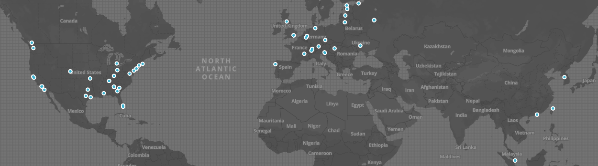

# Biomedical Blockchain Initiatives

There is tremendous interest and opportunity to apply blockchain technologies to problems in biology, medicine and health. We have created this repository to map all of the biomedical blockchain initiatives worldwide in order to track the evolution of this emerging technology. 

Check out [this blog post](http://hd2i.org/blog/2018/04/05/mapping-the-biomedical-blockchain.html) for a complete description of our approach and methodology. [Contributions are welcome](https://github.com/HD2i/biomedical-blockchain/blob/master/CONTRIBUTING.md) and encouraged. 

## Legend

Criteria for mention:
* **Code**: Must be publicly available and non-trivial.  White papers, tokens/token sales, road maps, forks without additional work, etc. are not considered.
* **Demo**: Must have a publicly available demo or working product.  Private betas are not considered.
  *  : demo/product is a web app
  *  : demo/product is a mobile app
* **Technical Documentation (Docs)**: Must have a publicly available technical whitepaper/specification.  Non-technical implementations are not considered.
  *  : link to technical whitepaper/specification
* **Professional investment ($MM)**: USD raised from professional investors.
 
____
 
## Source List Current Total: __*93*__ 
 
|                                                                                                                Site                                                                                                                |                          Name                           |              Category               |              Location              |                                                                        Code                                                                        |                                                       Demo                                                        |                                                                            Docs                                                                             |  Inv. ($MM)  |
|:----------------------------------------------------------------------------------------------------------------------------------------------------------------------------------------------------------------------------------:|:-------------------------------------------------------:|:-----------------------------------:|:----------------------------------:|:--------------------------------------------------------------------------------------------------------------------------------------------------:|:-----------------------------------------------------------------------------------------------------------------:|:---------------------------------------------------------------------------------------------------------------------------------------------------------:|:-------------:|
|                                                                                                                                          |                   [aimedis](#aimedis)                   |             Marketplace             |         Steyl, Netherlands         |                                                                   <!-- NA -->                                                                    |                                                   <!-- NA -->                                                   |                                                                       <!-- NA -->                                                                       |       -       |
|                                                              |                  [Ambrosus](#ambrosus)                  |            Supply Chain             |          Zug, Switzerland          |                       |                                                   <!-- NA -->                                                   |                                                                              |       -       |
|                                                                                                                     |                   [AMCHART](#amchart)                   |       Patient Data Management       |          Austin, TX, USA           |                                                                   <!-- NA -->                                                                    |                                                   <!-- NA -->                                                   |                                                                                                         |       -       |
|                                                                                                    |              [ARNA_Panacea](#arna_panacea)              |          Digital Medicine           |           Moscow, Russia           |                                                                   <!-- NA -->                                                                    |                                                   <!-- NA -->                                                   |                                                                                  |       -       |
|                                                                                                                                                      |                      [Beat](#beat)                      |             Marketplace             |          Hamburg, Germany          |                                                                   <!-- NA -->                                                                    |                                                   <!-- NA -->                                                   |                                                                                                   |       -       |
|                                                                                                                                        |                   [Bitmark](#bitmark)                   | Payments, Claims and Other Services |           Taipei, Taiwan           |        |                                                                        |                                                                       <!-- NA -->                                                                       |      1.7      |
|                                                                                                                         |                 [BlockMedx](#blockmedx)                 |          Digital Medicine           |         Lexington, KY, USA         |                      |                                                         |                                                                       <!-- NA -->                                                                       |       -       |
|                                                                                                             |                   [BlockRx](#blockrx)                   |            Supply Chain             |  Philadelphia, Pennsylvania, USA   |                                                                   <!-- NA -->                                                                    |                                                   <!-- NA -->                                                   |                                                      |       -       |
|                                                                                                                           |             [BowheadHealth](#bowheadhealth)             | Payments, Claims and Other Services |             Singapore              |                                                                   <!-- NA -->                                                                    |                                                   <!-- NA -->                                                   |                                                                |       -       |
|                                                                                                                                   |                 [Bron.tech](#bron.tech)                 |       Patient Data Management       | Sydney, New South Wales, Australia |                                                                   <!-- NA -->                                                                    |                                                                          |                                                                       <!-- NA -->                                                                       |      1.3      |
|                                                                                                       |                   [BurstIQ](#burstiq)                   |          Interoperability           |       Denver, Colorado, USA        |                        |                                                   <!-- NA -->                                                   |                                             |      5.0      |
|                                                                                                     |                 [CareChain](#carechain)                 |         Advisory/Consortium         |         Stockholm, Sweeden         |                      |                                                                  |                                                                       <!-- NA -->                                                                       |       -       |
|                                                                               |                    [CareMe](#careme)                    |             Marketplace             |        Miama, Florida, USA         |                        |                                                                      |                                                                       <!-- NA -->                                                                       |       -       |
|                                                                                                                                             | [CareX_Blockchain_Platform](#carex_blockchain_platform) | Payments, Claims and Other Services |        Bellaire, Texas, USA        |                      |                                                   <!-- NA -->                                                   |                                                                       <!-- NA -->                                                                       |       -       |
|                                                                                         |            [Citizen_Health](#citizen_health)            |             Marketplace             |        Hattiesburg, MS, USA        |                                                                   <!-- NA -->                                                                    |                                                   <!-- NA -->                                                   |                                                                       <!-- NA -->                                                                       |       -       |
|                                                                                                                                                    |                 [Clinicoin](#clinicoin)                 |          Digital Medicine           |          Seattle, WA, USA          |                     |                                                   <!-- NA -->                                                   |                                                                              |       -       |
|                                                                                                |                [CoinHealth](#coinhealth)                |       Patient Data Management       |         Dallas, Texas, USA         |          |                                                   <!-- NA -->                                                   |                                                                       <!-- NA -->                                                                       |       -       |
|                                                                                                           |               [CoralHealth](#coralhealth)               |          Interoperability           |         Vancouver, Canada          |                  |                                                   <!-- NA -->                                                   |                                                                                                       |       -       |
|                                                                                                     |                   [Cryogen](#cryogen)                   |          DIgital Medicine           |           Moscow, Russia           |                                                                   <!-- NA -->                                                                    |                                                   <!-- NA -->                                                   |                                                                       <!-- NA -->                                                                       |       -       |
|                                                                                                                            |                  [CureCoin](#curecoin)                  |          Digital Medicine           |                USA                 |        |  |                                                                       <!-- NA -->                                                                       |       -       |
|    |                  [Curisium](#curisium)                  | Payments, Claims, & Other Services  |  Manhattan Beach, California, USA  |                                                                   <!-- NA -->                                                                    |                                                   <!-- NA -->                                                   |                                                                       <!-- NA -->                                                                       |      3.5      |
|                                                        |                   [CoverUs](#coverus)                   | Payments, Claims and Other Services |         Brooklyn, NY, USA          |                                                                   <!-- NA -->                                                                    |                                                   <!-- NA -->                                                   |                                                                       <!-- NA -->                                                                       |       -       |
|                                                                                                    |                     [Datum](#datum)                     |             Marketplace             |            Switzerland             |                   |                                                                                 |                                                                       <!-- NA -->                                                                       |       -       |
|                                                                                                          |                 [Dentacoin](#dentacoin)                 |             Marketplace             |      Maastricht, Netherlands       |                      |                                                   <!-- NA -->                                                   |                                                                       <!-- NA -->                                                                       |       -       |
|                                                                                               |                 [DentalFix](#dentalfix)                 |            Supply Chain             |      Saint Petersburg, Russia      |                                                                   <!-- NA -->                                                                    |                                                   <!-- NA -->                                                   |                                                                       <!-- NA -->                                                                       |       -       |
|                                                                                                                                  |                 [Digipharm](#digipharm)                 |             Marketplace             |          Zug, Switzerland          |                                                                   <!-- NA -->                                                                    |                                                   <!-- NA -->                                                   |                                                                       <!-- NA -->                                                                       |       -       |
|                                                                                                    |                  [Doc_Coin](#doc_coin)                  |          Interoperability           |               Russia               |                     |                                                   <!-- NA -->                                                   |                                                                       <!-- NA -->                                                                       |       -       |
|                                                                                                                                                  |                    [doc.ai](#doc.ai)                    |          Digital Medicine           |     Palo Alto, California, USA     |                         |                                                                            |                                                   |       -       |
|                                                                                                            |                 [EarthMedz](#earthmedz)                 |         Advisory/Consortium         |             Australia              |                                                                   <!-- NA -->                                                                    |                                                   <!-- NA -->                                                   |                                                                       <!-- NA -->                                                                       |       -       |
|                                                                                                                                      |                    [ELCoin](#elcoin)                    |            Supply Chain             |            Riga, Latvia            |  |                                  |                                                                                             |       -       |
|                                                                                                        |                  [Elige.re](#elige.re)                  |    Research and Clinical Trials     |               Russia               |                        |                                                   <!-- NA -->                                                   |                                                                                                     |       -       |
|                                                                                                           |                  [Embleema](#embleema)                  |       Patient Data Management       |         New York, NY, USA          |              |                                                   <!-- NA -->                                                   |                                                                       <!-- NA -->                                                                       |       -       |
|                                                                                                  |                 [Encrypgen](#encrypgen)                 |          Digital Medicine           |    Coral Springs, Florida, USA     |                      |                                                                       |                                                                       <!-- NA -->                                                                       |       -       |
|                                                                                                                                      |                     [Enome](#enome)                     |    Research and Clinical Trials     |         Sydney, Australia          |                                                                   <!-- NA -->                                                                    |                                                   <!-- NA -->                                                   |                                                                       <!-- NA -->                                                                       |       -       |
|                                                    |                    [Eterly](#eterly)                    |          Digital medicine           |         Vancouver, Canada          |                                                                   <!-- NA -->                                                                    |                                             |                                                                       <!-- NA -->                                                                       |       -       |
|                                                                                                           |                    [Etheal](#etheal)                    |  Payments, Claims & Other Services  |         Budapest, Hungary          |                                                                   <!-- NA -->                                                                    |                                                   <!-- NA -->                                                   |                                                                       <!-- NA -->                                                                       |       -       |
|                                                                                                                                                            |                     [Faima](#faima)                     |          Digital medicine           |           Moscow, Russia           |                                                                   <!-- NA -->                                                                    |                                                   <!-- NA -->                                                   |                                                                       <!-- NA -->                                                                       |       -       |
|                                                                                                                         |                [FarmaTrust](#farmatrust)                |            Supply Chain             |          London, England           |                                                                   <!-- NA -->                                                                    |                                                   <!-- NA -->                                                   |                                                                       <!-- NA -->                                                                       |       -       |
|                                                                                                                       |                    [Gem.co](#gem.co)                    |             Marketplace             |             Venice, CA             |                          |                                                   <!-- NA -->                                                   |                                                                  |      7.1      |
|                                                                                                     |             [Hashed_Health](#hashed_health)             |         Advisory/Consortium         |     Nashville, Tennessee, USA      |                                                                   <!-- NA -->                                                                    |                                                   <!-- NA -->                                                   |                                                                       <!-- NA -->                                                                       |      1.8      |
|                                                                                                         |                    [Hayver](#hayver)                    |          Digital medicine           |            Georgia, USA            |                                                                   <!-- NA -->                                                                    |                                                   <!-- NA -->                                                   |                                                                       <!-- NA -->                                                                       |       -       |
|                                                                                                                                                     |                 [HealPoint](#healpoint)                 |          Digital medicine           |    Los Angeles, California, USA    |                                                                   <!-- NA -->                                                                    |                                                   <!-- NA -->                                                   |                                                                       <!-- NA -->                                                                       |       -       |
|                                                                                                          |            [Health_Monitor](#health_monitor)            |          Digital medicine           |    _estajovice, Czech Republic     |                                                                   <!-- NA -->                                                                    |                                                   <!-- NA -->                                                   |                                                                       <!-- NA -->                                                                       |       -       |
|                                                               |               [Health_Wizz](#health_wizz)               |       Patient Data Management       |    Falls Church, Virginia, USA     |                                                                   <!-- NA -->                                                                    |                                                   <!-- NA -->                                                   |                    |       -       |
|                                                                                                 |              [Healthcombix](#healthcombix)              |  Payments, Claims & Other Services  |     Nashville, Tennessee, USA      |                                                                   <!-- NA -->                                                                    |                                                   <!-- NA -->                                                   |                                                                                                           |       -       |
|                                                                                                                          |            [HealthLinkages](#healthlinkages)            |  Payments, Claims & Other Services  |   Mountain View, California, USA   |                                                                   <!-- NA -->                                                                    |                                                   <!-- NA -->                                                   |                                                                       <!-- NA -->                                                                       |      0.3      |
|                                                                                            |               [Healthureum](#healthureum)               |             Marketplace             |          Tallinn, Estonia          |                                                                   <!-- NA -->                                                                    |                                                   <!-- NA -->                                                   |                                                                       <!-- NA -->                                                                       |       -       |
|                                                                                                             |                   [Hearthy](#hearthy)                   |       Patient Data Management       |            Vigo, Spain             |                      |                                                                       |                                                                                 |       -       |
|                                                                                                                                       |                  [hieofone](#hieofone)                  |       Patient Data Management       |            Not Supplied            |                      |                                                   <!-- NA -->                                                   |                                                                       <!-- NA -->                                                                       |       -       |
|                                                                                                                     |            [hit_Foundation](#hit_foundation)            |          Digital medicine           |        Zurich, Switzerland         |                                                                   <!-- NA -->                                                                    |                                                   <!-- NA -->                                                   |                                                   |       -       |
|                                                                                                    |                [Ingeniciel](#ingeniciel)                |       Patient Data Management       |            Lyon, France            |              |                                                   <!-- NA -->                                                   |                                                                       <!-- NA -->                                                                       |       -       |
|                                                                                                                                           |                      [Iryo](#iryo)                      |       Patient Data Management       |          Kranj, Slovenia           |                    |                                                                   |                                                                                                    |       -       |
|                                                                         |         [Linda_Healthcare_](#linda_healthcare_)         |          Digital medicine           |     Palo Alto, California, USA     |                                                                   <!-- NA -->                                                                    |                                                                                                    |                                                            |       -       |
|                                                                                                                     |                     [Litra](#litra)                     |       Patient Data Management       |            Switzerland             |                                                                   <!-- NA -->                                                                    |                                                   <!-- NA -->                                                   |                                                                       <!-- NA -->                                                                       |       -       |
|                                                                                                   |                [Longenesis](#longenesis)                |             Marketplace             |             Hong Kong              |                                                                   <!-- NA -->                                                                    |                                                   <!-- NA -->                                                   |                                                                       <!-- NA -->                                                                       |       -       |
|                                                                                                             |                   [LunaDNA](#lunadna)                   |             Marketplace             |           San Diego, CA            |                                                                   <!-- NA -->                                                                    |                                                   <!-- NA -->                                                   |                                                                       <!-- NA -->                                                                       |      2.0      |
|                                                                                                                                   |          [Luven_Diagnostic](#luven_diagnostic)          |          Digital medicine           |              Ukraine               |                                                                   <!-- NA -->                                                                    |                                                   <!-- NA -->                                                   |                                                                       <!-- NA -->                                                                       |       -       |
|                                                                                                                                       |                     [Lympo](#lympo)                     |             Marketplace             |             Lithuania              |    |                                                   <!-- NA -->                                                   |                                                                          |       -       |
|                                                                                                               |                [MedCredits](#medcredits)                |          Digital medicine           |         Berkley, Michigan          |                                                                   <!-- NA -->                                                                    |                           |                                                                                    |       -       |
|                                                                        |                  [MediBloc](#medibloc)                  |             Marketplace             |         Seoul, South Korea         |                       |                                                   <!-- NA -->                                                   |                                                                       <!-- NA -->                                                                       |       -       |
|                                                                                        |                  [MediBond](#medibond)                  |  Payments, Claims & Other Services  |            Not Supplied            |                                                                   <!-- NA -->                                                                    |                                                   <!-- NA -->                                                   |                                                                       <!-- NA -->                                                                       |       -       |
|                                                                                    |              [Medicalchain](#medicalchain)              |       Patient Data Management       |          London, England           |                   |                                                               |                                                                                |       -       |
|                                                                                                           |                 [MediChain](#medichain)                 |       Patient Data Management       |             London, UK             |                      |                                                   <!-- NA -->                                                   |                                                   |       -       |
|                                                                                                                                         |              [medicohealth](#medicohealth)              |          Digital medicine           |        Ljubljana, Slovenia         |                                                                   <!-- NA -->                                                                    |                                                   <!-- NA -->                                                   |                                                                       <!-- NA -->                                                                       |       -       |
|                                                                    |                [MediLedger](#mediledger)                |            Supply Chain             |         San Francisco, CA          |          |                                                   <!-- NA -->                                                   |  |       -       |
|                                                                                |                [MedNetwork](#mednetwork)                |          Digital Medicine           |             Singapore              |                                                                   <!-- NA -->                                                                    |                                                                             |                                                                       <!-- NA -->                                                                       |       -       |
|                                                                                                                                 |                    [MedRec](#medrec)                    |       Patient Data Management       |   Cambridge, Massachusetts, USA    |                                                                   <!-- NA -->                                                                    |                                                   <!-- NA -->                                                   |                                                                                           |       -       |
|  |                [MedXchange](#medxchange)                |            Supply Chain             |          Hong Kong, China          |                                                                   <!-- NA -->                                                                    |                                                   <!-- NA -->                                                   |                                                             |       -       |
|                                                                                                 |                [minthealth](#minthealth)                |       Patient Data Management       |     San Diego, California, USA     |                                                                   <!-- NA -->                                                                    |                                                   <!-- NA -->                                                   |                                                                       <!-- NA -->                                                                       |       -       |
|                                                                                                        |                     [modum](#modum)                     |            Supply Chain             |        Zurich, Switzerland         |                       |                                                                          |                                                                |       -       |
|                                                                                                           |                   [MyMedis](#mymedis)                   |       Patient Data Management       |       Westerville, Ohio, USA       |                                                                   <!-- NA -->                                                                    |                                                   <!-- NA -->                                                   |                                                                                     |       -       |
|                                                                                                     |                [nanoVision](#nanovision)                |    Research and Clinical Trials     |         Austin, Texas, USA         |                                                                   <!-- NA -->                                                                    |                                                   <!-- NA -->                                                   |                                                                       <!-- NA -->                                                                       |       -       |
|                                                                 |           [Nebula_Genomics](#nebula_genomics)           |             Marketplace             |     Boston, Massachusetts, USA     |                                                                   <!-- NA -->                                                                    |                                                   <!-- NA -->                                                   |                                                             |      1.6      |
|                                                                                           |            [Open_Longevity](#open_longevity)            |          Digital Medicine           |           Moscow, Russia           |                                                                   <!-- NA -->                                                                    |                                                   <!-- NA -->                                                   |                                                                       <!-- NA -->                                                                       |       -       |
|                                                                                                                    |                [Patientory](#patientory)                |       Patient Data Management       |       Atlanta, Georgia, USA        |                                                                   <!-- NA -->                                                                    |                                                   <!-- NA -->                                                   |                                                                                       |       -       |
|                                                                     |                  [PokitDok](#pokitdok)                  | Payments, Claims, & Other Services  |          Sillicon Valley           |                       |                                             |                           |     55.3      |
|                                                                           |                [Proof.Work](#proof.work)                |       Patient Data Management       |          London, England           |                                                                   <!-- NA -->                                                                    |                                                                           |                                                                       <!-- NA -->                                                                       |       -       |
|                                                                                                                 |           [Robomed_Network](#robomed_network)           | Payments, Claims, & Other Services  |               Russia               |                                                                   <!-- NA -->                                                                    |                                                   <!-- NA -->                                                   |                                                                       <!-- NA -->                                                                       |       -       |
|                    |                  [ScalaMed](#scalamed)                  | Payments, Claims, & Other Services  |         Sydney, Australia          |                                                                   <!-- NA -->                                                                    |                                                   <!-- NA -->                                                   |                                                                       <!-- NA -->                                                                       |       -       |
|                                                                                                                  |                    [Shivom](#shivom)                    |             Marketplace             |          Munich, Germany           |                                                                   <!-- NA -->                                                                    |                                                   <!-- NA -->                                                   |                                                                                                 |       -       |
|                                                                                                  |       [Simply_Vital_Health](#simply_vital_health)       | Payments, Claims, & Other Services  |    Bloomfield, Connecticut, USA    |                   |                                                   <!-- NA -->                                                   |                                                                                                       |      0.5      |
|                                                                                                    |           [SmartHealthcare](#smarthealthcare)           | Payments, Claims, & Other Services  |              Estonia               |          |                                                   <!-- NA -->                                                   |                                                                                 |       -       |
|                                                                           |                [Solve.Care](#solve.care)                | Payments, Claims, & Other Services  |              Estonia               |                      |                                                                                                    |                                                                                            |       -       |
|                                                   |                  [Spiritus](#spiritus)                  |            Supply Chain             |     Edinburgh, United Kingdom      |                                                                   <!-- NA -->                                                                    |                                                   <!-- NA -->                                                   |                                                                       <!-- NA -->                                                                       |       -       |
|   |    [SSOT_Health_Blockchain](#ssot_health_blockchain)    | Payments, Claims, & Other Services  |   Cambridge, Massachusetts, USA    |                                                                   <!-- NA -->                                                                    |                                                   <!-- NA -->                                                   |                                                                       <!-- NA -->                                                                       |       -       |
|                                                                                                               |           [Synthium_Health](#synthium_health)           |            Supply Chain             |       Marietta, Georgia, USA       |                                                                   <!-- NA -->                                                                    |                                                   <!-- NA -->                                                   |                                                                       <!-- NA -->                                                                       |      0.5      |
|                                                                                                                                                   |                  [Timicoin](#timicoin)                  |       Patient Data Management       |            Not Supplied            |                                                                   <!-- NA -->                                                                    |                                                   <!-- NA -->                                                   |                                                                       <!-- NA -->                                                                       |       -       |
|                                                                                                            |             [trustedhealth](#trustedhealth)             |          Digital Medicine           |           United Kingdom           |                                                                   <!-- NA -->                                                                    |                                                   <!-- NA -->                                                   |                                                                       <!-- NA -->                                                                       |       -       |
|                                         |     [Universal_Health_Coin](#universal_health_coin)     | Payments, Claims, & Other Services  |       Augusta, Georgia, USA        |                                                                   <!-- NA -->                                                                    |                                                   <!-- NA -->                                                   |                                                           |       -       |
|                                                                                                                           |          [Veris_Foundation](#veris_foundation)          | Payments, Claims, & Other Services  |    Jersey City, New Jersey, USA    |                |                                                   <!-- NA -->                                                   |                                                                                                 |       -       |
|                                                                                                      |                      [WELL](#well)                      |          Digital Medicine           |   Santa Monica, California, USA    |                                                                   <!-- NA -->                                                                    |                                                   <!-- NA -->                                                   |                                                                       <!-- NA -->                                                                       |       -       |
|                                                                                                              |                   [Youbase](#youbase)                   |       Patient Data Management       |           Englewood, CO            |                        |                                                                         |                                                                                                      |      1.0      |
|                                                                                                                                                        |                    [Zenome](#zenome)                    |             Marketplace             |           Moscow, Russia           |                         |                                                   <!-- NA -->                                                   |                                                                                              |       -       | 
____
## aimedis
 
 

 
 
Platform to store and share medical records
 
 
 
|                   | Details            |
|:------------------|:-------------------|
| Category          | Marketplace        |
| Location          | Steyl, Netherlands |
| Money Raised (M)  | -                  |
| Method of Funding | ICO                |
| Github Profile    | <!-- NA -->      |
| ICO Symbol        | AIM                |
| Coin              | ERC20              |
| White Paper       | <!-- NA -->      | 
____
## Ambrosus
 
 

 
 
Quality control and assurance of pharmaceutical products
 
 
 
|                   | Details                                                                                                                       |
|:------------------|:------------------------------------------------------------------------------------------------------------------------------|
| Category          | Supply Chain                                                                                                                  |
| Location          | Zug, Switzerland                                                                                                              |
| Money Raised (M)  | $63.0                                                                                                                         |
| Method of Funding | ICO                                                                                                                           |
| Github Profile    |  |
| ICO Symbol        | AMB                                                                                                                           |
| Coin              | ERC20                                                                                                                         |
| White Paper       |                                                  | 
____
## AMCHART
 
 

 
 
Incentive based EHR management.
 
 
 
|                   | Details                                            |
|:------------------|:---------------------------------------------------|
| Category          | Patient Data Management                            |
| Location          | Austin, TX, USA                                    |
| Money Raised (M)  | $45.0                                              |
| Method of Funding | ICO                                                |
| Github Profile    | <!-- NA -->                                      |
| ICO Symbol        | AMC                                                |
| Coin              | ERC20                                              |
| White Paper       |  | 
____
## ARNA_Panacea
 
 

 
 
Research oriented data exchange service focused on cancer.
 
 
 
|                   | Details                                                                   |
|:------------------|:--------------------------------------------------------------------------|
| Category          | Digital Medicine                                                          |
| Location          | Moscow, Russia                                                            |
| Money Raised (M)  | $0.5                                                                      |
| Method of Funding | -                                                                         |
| Github Profile    | <!-- NA -->                                                             |
| ICO Symbol        | ARNA                                                                      |
| Coin              | ERC20                                                                     |
| White Paper       |  | 
____
## Beat
 
 

 
 
Consumer health pipeline for sharing wearable and fitness data with EHR's
 
 
 
|                   | Details                                                  |
|:------------------|:---------------------------------------------------------|
| Category          | Marketplace                                              |
| Location          | Hamburg, Germany                                         |
| Money Raised (M)  | $22.0                                                    |
| Method of Funding | ICO                                                      |
| Github Profile    | <!-- NA -->                                            |
| ICO Symbol        | BEAT                                                     |
| Coin              | ERC20                                                    |
| White Paper       |  | 
____
## Bitmark
 
 

 
 
A universal system for digital property rights
 
 
 
|                   | Details                                                                                                                                      |
|:------------------|:---------------------------------------------------------------------------------------------------------------------------------------------|
| Category          | Payments, Claims and Other Services                                                                                                          |
| Location          | Taipei, Taiwan                                                                                                                               |
| Money Raised (M)  | $1.7                                                                                                                                         |
| Method of Funding | SEED                                                                                                                                         |
| Github Profile    |  |
| ICO Symbol        | BTM                                                                                                                                          |
| Coin              | BTC                                                                                                                                          |
| White Paper       | <!-- NA -->                                                                                                                                | 
____
## BlockMedx
 
 

 
 
Electronic prescription drug supply chain management, focused on opioids and other notoriously mismanaged drugs.
 
 
 
|                   | Details                                                                                                                        |
|:------------------|:-------------------------------------------------------------------------------------------------------------------------------|
| Category          | Digital Medicine                                                                                                               |
| Location          | Lexington, KY, USA                                                                                                             |
| Money Raised (M)  | -                                                                                                                              |
| Method of Funding | ICO                                                                                                                            |
| Github Profile    |  |
| ICO Symbol        | MDX                                                                                                                            |
| Coin              | ERC20                                                                                                                          |
| White Paper       | <!-- NA -->                                                                                                                  | 
____
## BlockRx
 
 

 
 
Pharmaceutical supply chain, coupled with clinical trial outcomes and regulation approval.
 
 
 
|                   | Details                                                                                               |
|:------------------|:------------------------------------------------------------------------------------------------------|
| Category          | Supply Chain                                                                                          |
| Location          | Philadelphia, Pennsylvania, USA                                                                       |
| Money Raised (M)  | -                                                                                                     |
| Method of Funding | ICO                                                                                                   |
| Github Profile    | <!-- NA -->                                                                                         |
| ICO Symbol        | BKRx                                                                                                  |
| Coin              | -                                                                                                     |
| White Paper       |  | 
____
## BowheadHealth
 
 

 
 
Hardware device that monitors a customer's biometric data to dispense medicine and supplements. 
 
 
 
|                   | Details                                                                                     |
|:------------------|:--------------------------------------------------------------------------------------------|
| Category          | Payments, Claims and Other Services                                                         |
| Location          | Singapore                                                                                   |
| Money Raised (M)  | $1.0                                                                                        |
| Method of Funding | ICO                                                                                         |
| Github Profile    | <!-- NA -->                                                                               |
| ICO Symbol        | AHT                                                                                         |
| Coin              | ERC20                                                                                       |
| White Paper       |  | 
____
## Bron.tech
 
 

 
 
Platform for data sharing and identity management
 
 
 
|                   | Details                            |
|:------------------|:-----------------------------------|
| Category          | Patient Data Management            |
| Location          | Sydney, New South Wales, Australia |
| Money Raised (M)  | -                                  |
| Method of Funding | SEED                               |
| Github Profile    | <!-- NA -->                      |
| ICO Symbol        | BRON                               |
| Coin              | -                                  |
| White Paper       | <!-- NA -->                      | 
____
## BurstIQ
 
 

 
 
Personalized data integration across EHR , wearables and social profile
 
 
 
|                   | Details                                                                                                                      |
|:------------------|:-----------------------------------------------------------------------------------------------------------------------------|
| Category          | Interoperability                                                                                                             |
| Location          | Denver, Colorado, USA                                                                                                        |
| Money Raised (M)  | $5.0                                                                                                                         |
| Method of Funding | SEED                                                                                                                         |
| Github Profile    |  |
| ICO Symbol        | BiQ                                                                                                                          |
| Coin              | -                                                                                                                            |
| White Paper       |                | 
____
## CareChain
 
 

 
 
Consortium within Swedish ecosystem to tackle regulatory challenges related to blockchain infrastructure and personal data management for health. 
 
 
 
|                   | Details                                                                                                                        |
|:------------------|:-------------------------------------------------------------------------------------------------------------------------------|
| Category          | Advisory/Consortium                                                                                                            |
| Location          | Stockholm, Sweeden                                                                                                             |
| Money Raised (M)  | -                                                                                                                              |
| Method of Funding | -                                                                                                                              |
| Github Profile    |  |
| ICO Symbol        | -                                                                                                                              |
| Coin              | -                                                                                                                              |
| White Paper       | <!-- NA -->                                                                                                                  | 
____
## CareMe
 
 

 
 
Connects nurses to patients in need of care
 
 
 
|                   | Details                                                                                                                      |
|:------------------|:-----------------------------------------------------------------------------------------------------------------------------|
| Category          | Marketplace                                                                                                                  |
| Location          | Miama, Florida, USA                                                                                                          |
| Money Raised (M)  | -                                                                                                                            |
| Method of Funding | -                                                                                                                            |
| Github Profile    |  |
| ICO Symbol        | -                                                                                                                            |
| Coin              | ERC20                                                                                                                        |
| White Paper       | <!-- NA -->                                                                                                                | 
____
## CareX_Blockchain_Platform
 
 

 
 
A method for the payment of health care services.
 
 
 
|                   | Details                                                                                                                        |
|:------------------|:-------------------------------------------------------------------------------------------------------------------------------|
| Category          | Payments, Claims and Other Services                                                                                            |
| Location          | Bellaire, Texas, USA                                                                                                           |
| Money Raised (M)  | $10.0                                                                                                                          |
| Method of Funding | ICO                                                                                                                            |
| Github Profile    |  |
| ICO Symbol        | CARE                                                                                                                           |
| Coin              | ERC20                                                                                                                          |
| White Paper       | <!-- NA -->                                                                                                                  | 
____
## Citizen_Health
 
 

 
 
A peer-to-peer health market owned and controlled by the people & physicians.
 
 
 
|                   | Details              |
|:------------------|:---------------------|
| Category          | Marketplace          |
| Location          | Hattiesburg, MS, USA |
| Money Raised (M)  | -                    |
| Method of Funding | ICO                  |
| Github Profile    | <!-- NA -->        |
| ICO Symbol        | MDX                  |
| Coin              | ERC20                |
| White Paper       | <!-- NA -->        | 
____
## Clinicoin
 
 

 
 
Clinicoin is a blockchain platform that pays you to be healthy
 
 
 
|                   | Details                                                                                                                         |
|:------------------|:--------------------------------------------------------------------------------------------------------------------------------|
| Category          | Digital Medicine                                                                                                                |
| Location          | Seattle, WA, USA                                                                                                                |
| Money Raised (M)  | -                                                                                                                               |
| Method of Funding | ICO                                                                                                                             |
| Github Profile    |  |
| ICO Symbol        | CLIN                                                                                                                            |
| Coin              | ERC20                                                                                                                           |
| White Paper       |                                                    | 
____
## CoinHealth
 
 

 
 
Mobile platform for medical records, verification, and payment solutions
 
 
 
|                   | Details                                                                                                                                    |
|:------------------|:-------------------------------------------------------------------------------------------------------------------------------------------|
| Category          | Patient Data Management                                                                                                                    |
| Location          | Dallas, Texas, USA                                                                                                                         |
| Money Raised (M)  | $0.1                                                                                                                                       |
| Method of Funding | ICO                                                                                                                                        |
| Github Profile    |  |
| ICO Symbol        | COINHEALTH                                                                                                                                 |
| Coin              | WAVES                                                                                                                                      |
| White Paper       | <!-- NA -->                                                                                                                              | 
____
## CoralHealth
 
 

 
 
Aligning the interests of different players in the healthcare ecosystem
 
 
 
|                   | Details                                                                                                                            |
|:------------------|:-----------------------------------------------------------------------------------------------------------------------------------|
| Category          | Interoperability                                                                                                                   |
| Location          | Vancouver, Canada                                                                                                                  |
| Money Raised (M)  | -                                                                                                                                  |
| Method of Funding | -                                                                                                                                  |
| Github Profile    |  |
| ICO Symbol        | -                                                                                                                                  |
| Coin              | -                                                                                                                                  |
| White Paper       |                                                                                | 
____
## Cryogen
 
 

 
 
Reversible freezing of donor organs and organisms for the purpose of life extension and long space flights.
 
 
 
|                   | Details          |
|:------------------|:-----------------|
| Category          | DIgital Medicine |
| Location          | Moscow, Russia   |
| Money Raised (M)  | $2.5             |
| Method of Funding | ICO              |
| Github Profile    | <!-- NA -->    |
| ICO Symbol        | CRYO             |
| Coin              | ERC20            |
| White Paper       | <!-- NA -->    | 
____
## CureCoin
 
 

 
 
A protein folding simulation Distributed Computing Network
 
 
 
|                   | Details                                                                                                                                      |
|:------------------|:---------------------------------------------------------------------------------------------------------------------------------------------|
| Category          | Digital Medicine                                                                                                                             |
| Location          | USA                                                                                                                                          |
| Money Raised (M)  | $6.8                                                                                                                                         |
| Method of Funding | ICO                                                                                                                                          |
| Github Profile    |  |
| ICO Symbol        | CURE                                                                                                                                         |
| Coin              | ERC20                                                                                                                                        |
| White Paper       | <!-- NA -->                                                                                                                                | 
____
## Curisium
 
 

 
 
Platform to allow payers, providers, and life science companies to engage with patient-value-based contracts.
 
 
 
|                   | Details                            |
|:------------------|:-----------------------------------|
| Category          | Payments, Claims, & Other Services |
| Location          | Manhattan Beach, California, USA   |
| Money Raised (M)  | -                                  |
| Method of Funding | SEED                               |
| Github Profile    | <!-- NA -->                      |
| ICO Symbol        | AIM                                |
| Coin              | -                                  |
| White Paper       | <!-- NA -->                      | 
____
## CoverUs
 
 

 
 
Broker your health data to interested parties
 
 
 
|                   | Details                             |
|:------------------|:------------------------------------|
| Category          | Payments, Claims and Other Services |
| Location          | Brooklyn, NY, USA                   |
| Money Raised (M)  | -                                   |
| Method of Funding | -                                   |
| Github Profile    | <!-- NA -->                       |
| ICO Symbol        | -                                   |
| Coin              | -                                   |
| White Paper       | <!-- NA -->                       | 
____
## Datum
 
 

 
 
NoSQL database backed by a blockchain ledger
 
 
 
|                   | Details                                                                                                                           |
|:------------------|:----------------------------------------------------------------------------------------------------------------------------------|
| Category          | Marketplace                                                                                                                       |
| Location          | Switzerland                                                                                                                       |
| Money Raised (M)  | $7.2                                                                                                                              |
| Method of Funding | ICO                                                                                                                               |
| Github Profile    |  |
| ICO Symbol        | DAT                                                                                                                               |
| Coin              | ERC20                                                                                                                             |
| White Paper       | <!-- NA -->                                                                                                                     | 
____
## Dentacoin
 
 

 
 
Dental care marketplace
 
 
 
|                   | Details                                                                                                                        |
|:------------------|:-------------------------------------------------------------------------------------------------------------------------------|
| Category          | Marketplace                                                                                                                    |
| Location          | Maastricht, Netherlands                                                                                                        |
| Money Raised (M)  | $2.1                                                                                                                           |
| Method of Funding | ICO                                                                                                                            |
| Github Profile    |  |
| ICO Symbol        | DCN                                                                                                                            |
| Coin              | ERC20                                                                                                                          |
| White Paper       | <!-- NA -->                                                                                                                  | 
____
## DentalFix
 
 

 
 
Dental clinics and the supply chain.
 
 
 
|                   | Details                  |
|:------------------|:-------------------------|
| Category          | Supply Chain             |
| Location          | Saint Petersburg, Russia |
| Money Raised (M)  | $0.2                     |
| Method of Funding | ICO                      |
| Github Profile    | <!-- NA -->            |
| ICO Symbol        | DFBT                     |
| Coin              | WAVES                    |
| White Paper       | <!-- NA -->            | 
____
## Digipharm
 
 

 
 
Value based healthcare access
 
 
 
|                   | Details          |
|:------------------|:-----------------|
| Category          | Marketplace      |
| Location          | Zug, Switzerland |
| Money Raised (M)  | -                |
| Method of Funding | -                |
| Github Profile    | <!-- NA -->    |
| ICO Symbol        | -                |
| Coin              | -                |
| White Paper       | <!-- NA -->    | 
____
## Doc_Coin
 
 

 
 
Telehealth, expedited care and access
 
 
 
|                   | Details                                                                                                                         |
|:------------------|:--------------------------------------------------------------------------------------------------------------------------------|
| Category          | Interoperability                                                                                                                |
| Location          | Russia                                                                                                                          |
| Money Raised (M)  | -                                                                                                                               |
| Method of Funding | ICO                                                                                                                             |
| Github Profile    |  |
| ICO Symbol        | DOC                                                                                                                             |
| Coin              | ERC20                                                                                                                           |
| White Paper       | <!-- NA -->                                                                                                                   | 
____
## doc.ai
 
 

 
 
A mobile app for aquiring and exploring -OMICS data
 
 
 
|                   | Details                                                                                                                     |
|:------------------|:----------------------------------------------------------------------------------------------------------------------------|
| Category          | Digital Medicine                                                                                                            |
| Location          | Palo Alto, California, USA                                                                                                  |
| Money Raised (M)  | $12.3                                                                                                                       |
| Method of Funding | ICO                                                                                                                         |
| Github Profile    |  |
| ICO Symbol        | NRN                                                                                                                         |
| Coin              | ERC20                                                                                                                       |
| White Paper       |                     | 
____
## EarthMedz
 
 

 
 
Matching specialists and patients with rare conditions
 
 
 
|                   | Details             |
|:------------------|:--------------------|
| Category          | Advisory/Consortium |
| Location          | Australia           |
| Money Raised (M)  | -                   |
| Method of Funding | ICO                 |
| Github Profile    | <!-- NA -->       |
| ICO Symbol        | ETD                 |
| Coin              | ERC20               |
| White Paper       | <!-- NA -->       | 
____
## ELCoin
 
 

 
 
Expanding the availability of innovative medical equipment
 
 
 
|                   | Details                                                                                                                                            |
|:------------------|:---------------------------------------------------------------------------------------------------------------------------------------------------|
| Category          | Supply Chain                                                                                                                                       |
| Location          | Riga, Latvia                                                                                                                                       |
| Money Raised (M)  | -                                                                                                                                                  |
| Method of Funding | ICO                                                                                                                                                |
| Github Profile    |  |
| ICO Symbol        | ELC                                                                                                                                                |
| Coin              | ERC20                                                                                                                                              |
| White Paper       |                                                                                      | 
____
## Elige.re
 
 

 
 
Peer shared computational power for protein folding
 
 
 
|                   | Details                                                                                                                      |
|:------------------|:-----------------------------------------------------------------------------------------------------------------------------|
| Category          | Research and Clinical Trials                                                                                                 |
| Location          | Russia                                                                                                                       |
| Money Raised (M)  | -                                                                                                                            |
| Method of Funding | ICO                                                                                                                          |
| Github Profile    |  |
| ICO Symbol        | ELG                                                                                                                          |
| Coin              | ERC20                                                                                                                        |
| White Paper       |                                                                        | 
____
## Embleema
 
 

 
 
PatientTruth for cloud based medical records
 
 
 
|                   | Details                                                                                                                                |
|:------------------|:---------------------------------------------------------------------------------------------------------------------------------------|
| Category          | Patient Data Management                                                                                                                |
| Location          | New York, NY, USA                                                                                                                      |
| Money Raised (M)  | -                                                                                                                                      |
| Method of Funding | -                                                                                                                                      |
| Github Profile    |  |
| ICO Symbol        | -                                                                                                                                      |
| Coin              | -                                                                                                                                      |
| White Paper       | <!-- NA -->                                                                                                                          | 
____
## Encrypgen
 
 

 
 
Cloud storage and sharing of genomic data
 
 
 
|                   | Details                                                                                                                        |
|:------------------|:-------------------------------------------------------------------------------------------------------------------------------|
| Category          | Digital Medicine                                                                                                               |
| Location          | Coral Springs, Florida, USA                                                                                                    |
| Money Raised (M)  | $12.0                                                                                                                          |
| Method of Funding | ICO                                                                                                                            |
| Github Profile    |  |
| ICO Symbol        | DNA                                                                                                                            |
| Coin              | ERC20                                                                                                                          |
| White Paper       | <!-- NA -->                                                                                                                  | 
____
## Enome
 
 

 
 
Allows consumers to anonymously share their data for medical research.
 
 
 
|                   | Details                      |
|:------------------|:-----------------------------|
| Category          | Research and Clinical Trials |
| Location          | Sydney, Australia            |
| Money Raised (M)  | -                            |
| Method of Funding | -                            |
| Github Profile    | <!-- NA -->                |
| ICO Symbol        | -                            |
| Coin              | -                            |
| White Paper       | <!-- NA -->                | 
____
## Eterly
 
 

 
 
Health and fitness advisor focusing on longevity, using token-based incentives
 
 
 
|                   | Details           |
|:------------------|:------------------|
| Category          | Digital medicine  |
| Location          | Vancouver, Canada |
| Money Raised (M)  | -                 |
| Method of Funding | ICO               |
| Github Profile    | <!-- NA -->     |
| ICO Symbol        | LTY               |
| Coin              | ERC20             |
| White Paper       | <!-- NA -->     | 
____
## Etheal
 
 

 
 
Trusted review system for medical tourism
 
 
 
|                   | Details                           |
|:------------------|:----------------------------------|
| Category          | Payments, Claims & Other Services |
| Location          | Budapest, Hungary                 |
| Money Raised (M)  | -                                 |
| Method of Funding | ICO                               |
| Github Profile    | <!-- NA -->                     |
| ICO Symbol        | HEAL                              |
| Coin              | ERC20                             |
| White Paper       | <!-- NA -->                     | 
____
## Faima
 
 

 
 
AI driven diagnosis and clinical decision support
 
 
 
|                   | Details          |
|:------------------|:-----------------|
| Category          | Digital medicine |
| Location          | Moscow, Russia   |
| Money Raised (M)  | -                |
| Method of Funding | ICO              |
| Github Profile    | <!-- NA -->    |
| ICO Symbol        | MEDS             |
| Coin              | ERC20            |
| White Paper       | <!-- NA -->    | 
____
## FarmaTrust
 
 

 
 
a platform for tracking drug authenticity
 
 
 
|                   | Details         |
|:------------------|:----------------|
| Category          | Supply Chain    |
| Location          | London, England |
| Money Raised (M)  | -               |
| Method of Funding | ICO             |
| Github Profile    | <!-- NA -->   |
| ICO Symbol        | FTT             |
| Coin              | ERC20           |
| White Paper       | <!-- NA -->   | 
____
## Gem.co
 
 

 
 
Allows individuals to benefit from the value of their own data
 
 
 
|                   | Details                                                                                                                    |
|:------------------|:---------------------------------------------------------------------------------------------------------------------------|
| Category          | Marketplace                                                                                                                |
| Location          | Venice, CA                                                                                                                 |
| Money Raised (M)  | $7.1                                                                                                                       |
| Method of Funding | SERIES                                                                                                                     |
| Github Profile    |  |
| ICO Symbol        | GEM                                                                                                                        |
| Coin              | ERC20                                                                                                                      |
| White Paper       |                                   | 
____
## Hashed_Health
 
 

 
 
A healthcare innovation consultancy focused on accelerating meaningful innovation using blockchain
 
 
 
|                   | Details                   |
|:------------------|:--------------------------|
| Category          | Advisory/Consortium       |
| Location          | Nashville, Tennessee, USA |
| Money Raised (M)  | $1.8                      |
| Method of Funding | SEED                      |
| Github Profile    | <!-- NA -->             |
| ICO Symbol        | -                         |
| Coin              | -                         |
| White Paper       | <!-- NA -->             | 
____
## Hayver
 
 

 
 
Advanced monitoring platform to address drug and alcohol addiction
 
 
 
|                   | Details          |
|:------------------|:-----------------|
| Category          | Digital medicine |
| Location          | Georgia, USA     |
| Money Raised (M)  | -                |
| Method of Funding | -                |
| Github Profile    | <!-- NA -->    |
| ICO Symbol        | -                |
| Coin              | ERC-20/223       |
| White Paper       | <!-- NA -->    | 
____
## HealPoint
 
 

 
 
Second opinion platform for medical diagnostics
 
 
 
|                   | Details                      |
|:------------------|:-----------------------------|
| Category          | Digital medicine             |
| Location          | Los Angeles, California, USA |
| Money Raised (M)  | -                            |
| Method of Funding | ICO                          |
| Github Profile    | <!-- NA -->                |
| ICO Symbol        | HLP                          |
| Coin              | ERC20                        |
| White Paper       | <!-- NA -->                | 
____
## Health_Monitor
 
 

 
 
Non-invasive diagnostics of blood glucose level, lung cancer, stomach ulcer and diabetes.
 
 
 
|                   | Details                     |
|:------------------|:----------------------------|
| Category          | Digital medicine            |
| Location          | _estajovice, Czech Republic |
| Money Raised (M)  | $0.5                        |
| Method of Funding | ICO                         |
| Github Profile    | <!-- NA -->               |
| ICO Symbol        | HLC                         |
| Coin              | ERC20                       |
| White Paper       | <!-- NA -->               | 
____
## Health_Wizz
 
 

 
 
Mobile platform to aggregate, organize, and share medical records. 
 
*Notable: CEO was on CNBC https://www.cnbc.com/video/2017/12/26/how-we-are-using-blockchain-technology-to-secure-your-health-records-heath-wizz-ceo.html*
 
 
|                   | Details                                                                                                                                 |
|:------------------|:----------------------------------------------------------------------------------------------------------------------------------------|
| Category          | Patient Data Management                                                                                                                 |
| Location          | Falls Church, Virginia, USA                                                                                                             |
| Money Raised (M)  | -                                                                                                                                       |
| Method of Funding | ICO                                                                                                                                     |
| Github Profile    | <!-- NA -->                                                                                                                           |
| ICO Symbol        | -                                                                                                                                       |
| Coin              | -                                                                                                                                       |
| White Paper       |  | 
____
## Healthcombix
 
 

 
 
Healthcare blockchain, distributed ledger, and decentralized network strategy and product development company.
 
 
 
|                   | Details                                          |
|:------------------|:-------------------------------------------------|
| Category          | Payments, Claims & Other Services                |
| Location          | Nashville, Tennessee, USA                        |
| Money Raised (M)  | -                                                |
| Method of Funding | -                                                |
| Github Profile    | <!-- NA -->                                    |
| ICO Symbol        | -                                                |
| Coin              | -                                                |
| White Paper       |  | 
____
## HealthLinkages
 
 

 
 
Uses blockchain-inspired technology to allow healthcare institutions to trust and share data
 
 
 
|                   | Details                           |
|:------------------|:----------------------------------|
| Category          | Payments, Claims & Other Services |
| Location          | Mountain View, California, USA    |
| Money Raised (M)  | -                                 |
| Method of Funding | SEED                              |
| Github Profile    | <!-- NA -->                     |
| ICO Symbol        | -                                 |
| Coin              | -                                 |
| White Paper       | <!-- NA -->                     | 
____
## Healthureum
 
 

 
 
Data consolidation and exchange, doctor consult and referrals and medial infrastructure
 
 
 
|                   | Details          |
|:------------------|:-----------------|
| Category          | Marketplace      |
| Location          | Tallinn, Estonia |
| Money Raised (M)  | -                |
| Method of Funding | ICO              |
| Github Profile    | <!-- NA -->    |
| ICO Symbol        | HHEM             |
| Coin              | ERC20            |
| White Paper       | <!-- NA -->    | 
____
## Hearthy
 
 

 
 
Personal Health Record, token and app ecosystem to improve healthcare access
 
 
 
|                   | Details                                                                                                                        |
|:------------------|:-------------------------------------------------------------------------------------------------------------------------------|
| Category          | Patient Data Management                                                                                                        |
| Location          | Vigo, Spain                                                                                                                    |
| Money Raised (M)  | -                                                                                                                              |
| Method of Funding | ICO                                                                                                                            |
| Github Profile    |  |
| ICO Symbol        | HER                                                                                                                            |
| Coin              | ERC20                                                                                                                          |
| White Paper       |                                                      | 
____
## hieofone
 
 

 
 
Project to combine emerging standards for access authorization and blockchain-based self-sovereign identity into a patient-centered health record infrastructure.
 
*Notable: Volunteer open-source project*
 
 
|                   | Details                                                                                                                        |
|:------------------|:-------------------------------------------------------------------------------------------------------------------------------|
| Category          | Patient Data Management                                                                                                        |
| Location          | Not Supplied                                                                                                                   |
| Money Raised (M)  | -                                                                                                                              |
| Method of Funding | -                                                                                                                              |
| Github Profile    |  |
| ICO Symbol        | -                                                                                                                              |
| Coin              | -                                                                                                                              |
| White Paper       | <!-- NA -->                                                                                                                  | 
____
## hit_Foundation
 
 

 
 
Marketplace for personal health data
 
 
 
|                   | Details                                                                                                  |
|:------------------|:---------------------------------------------------------------------------------------------------------|
| Category          | Digital medicine                                                                                         |
| Location          | Zurich, Switzerland                                                                                      |
| Money Raised (M)  | -                                                                                                        |
| Method of Funding | ICO                                                                                                      |
| Github Profile    | <!-- NA -->                                                                                            |
| ICO Symbol        | HIT                                                                                                      |
| Coin              | ERC20                                                                                                    |
| White Paper       |  | 
____
## Ingeniciel
 
 

 
 
Store and manage medical records
 
 
 
|                   | Details                                                                                                                                |
|:------------------|:---------------------------------------------------------------------------------------------------------------------------------------|
| Category          | Patient Data Management                                                                                                                |
| Location          | Lyon, France                                                                                                                           |
| Money Raised (M)  | -                                                                                                                                      |
| Method of Funding | ICO                                                                                                                                    |
| Github Profile    |  |
| ICO Symbol        | INGCL                                                                                                                                  |
| Coin              | NXT                                                                                                                                    |
| White Paper       | <!-- NA -->                                                                                                                          | 
____
## Iryo
 
 

 
 
Health record storage platform, with an anonymous query interface. Controls for patient record access and tokens to incentivize  consent enabling artificial intelligence (AI) research. 
 
 
 
|                   | Details                                                                                                                          |
|:------------------|:---------------------------------------------------------------------------------------------------------------------------------|
| Category          | Patient Data Management                                                                                                          |
| Location          | Kranj, Slovenia                                                                                                                  |
| Money Raised (M)  | -                                                                                                                                |
| Method of Funding | ICO                                                                                                                              |
| Github Profile    |  |
| ICO Symbol        | IRYO                                                                                                                             |
| Coin              | EOS                                                                                                                              |
| White Paper       |                                                                           | 
____
## Linda_Healthcare_
 
 

 
 
Primary care telemedicine A.I. chatbot
 
 
 
|                   | Details                                                                                         |
|:------------------|:------------------------------------------------------------------------------------------------|
| Category          | Digital medicine                                                                                |
| Location          | Palo Alto, California, USA                                                                      |
| Money Raised (M)  | -                                                                                               |
| Method of Funding | ICO                                                                                             |
| Github Profile    | <!-- NA -->                                                                                   |
| ICO Symbol        | LNDA                                                                                            |
| Coin              | ERC20                                                                                           |
| White Paper       |  | 
____
## Litra
 
 

 
 
Free electronic health records running on the Litra blockchain
 
 
 
|                   | Details                 |
|:------------------|:------------------------|
| Category          | Patient Data Management |
| Location          | Switzerland             |
| Money Raised (M)  | -                       |
| Method of Funding | ICO                     |
| Github Profile    | <!-- NA -->           |
| ICO Symbol        | LTA                     |
| Coin              | Litecoin                |
| White Paper       | <!-- NA -->           | 
____
## Longenesis
 
 

 
 
Platform which uses AI to store, manage, and trade life data: medical records, social network, and health data. 
 
 
 
|                   | Details       |
|:------------------|:--------------|
| Category          | Marketplace   |
| Location          | Hong Kong     |
| Money Raised (M)  | -             |
| Method of Funding | ICO           |
| Github Profile    | <!-- NA --> |
| ICO Symbol        | -             |
| Coin              | LifePound     |
| White Paper       | <!-- NA --> | 
____
## LunaDNA
 
 

 
 
Luna is a community owned database that rewards individuals Luna Coins for contributing their DNA and other medical information.
 
*Notable: Ex-Illumina execs on CNBC https://www.cnbc.com/2017/12/18/luna-coin-project-sell-your-genetic-data-for-crypto-tokens.html*
 
 
|                   | Details       |
|:------------------|:--------------|
| Category          | Marketplace   |
| Location          | San Diego, CA |
| Money Raised (M)  | $2.0          |
| Method of Funding | SEED,ICO      |
| Github Profile    | <!-- NA --> |
| ICO Symbol        | -             |
| Coin              | -             |
| White Paper       | <!-- NA --> | 
____
## Luven_Diagnostic
 
 

 
 
Early stage cancer diagnostic
 
 
 
|                   | Details          |
|:------------------|:-----------------|
| Category          | Digital medicine |
| Location          | Ukraine          |
| Money Raised (M)  | -                |
| Method of Funding | ICO              |
| Github Profile    | <!-- NA -->    |
| ICO Symbol        | LVN              |
| Coin              | ERC20            |
| White Paper       | <!-- NA -->    | 
____
## Lympo
 
 

 
 
Monetizing sports and health data
 
 
 
|                   | Details                                                                                                                                          |
|:------------------|:-------------------------------------------------------------------------------------------------------------------------------------------------|
| Category          | Marketplace                                                                                                                                      |
| Location          | Lithuania                                                                                                                                        |
| Money Raised (M)  | $12.8                                                                                                                                            |
| Method of Funding | ICO                                                                                                                                              |
| Github Profile    |  |
| ICO Symbol        | LYM                                                                                                                                              |
| Coin              | ERC20                                                                                                                                            |
| White Paper       |                                                                 | 
____
## MedCredits
 
 

 
 
Telemedicine on the blockchain, powered by a public decentralized registry of physicians
 
*Notable: Partnered with Civic https://www.coinspeaker.com/2018/03/21/medcredits-civic-partner-first-blockchain-powered-physician-registry/*
 
 
|                   | Details                                                                 |
|:------------------|:------------------------------------------------------------------------|
| Category          | Digital medicine                                                        |
| Location          | Berkley, Michigan                                                       |
| Money Raised (M)  | -                                                                       |
| Method of Funding | ICO                                                                     |
| Github Profile    | <!-- NA -->                                                           |
| ICO Symbol        | MEDX                                                                    |
| Coin              | ERC20                                                                   |
| White Paper       |  | 
____
## MediBloc
 
 

 
 
a decentralized healthcare information ecosystem for patients, healthcare providers and data researchers, built on blockchain technology.
 
 
 
|                   | Details                                                                                                                       |
|:------------------|:------------------------------------------------------------------------------------------------------------------------------|
| Category          | Marketplace                                                                                                                   |
| Location          | Seoul, South Korea                                                                                                            |
| Money Raised (M)  | -                                                                                                                             |
| Method of Funding | ICO                                                                                                                           |
| Github Profile    |  |
| ICO Symbol        | QTUM                                                                                                                          |
| Coin              | MED                                                                                                                           |
| White Paper       | <!-- NA -->                                                                                                                 | 
____
## MediBond
 
 

 
 
Verification system for prescriptions, claims and orders; medical records management; and personal health record
 
 
 
|                   | Details                           |
|:------------------|:----------------------------------|
| Category          | Payments, Claims & Other Services |
| Location          | Not Supplied                      |
| Money Raised (M)  | -                                 |
| Method of Funding | ICO                               |
| Github Profile    | <!-- NA -->                     |
| ICO Symbol        | MEDI                              |
| Coin              | ERC20                             |
| White Paper       | <!-- NA -->                     | 
____
## Medicalchain
 
 

 
 
Platform for storage and transfer of electronic health records
 
*Notable: Traded on @bitfinex*
 
 
|                   | Details                                                                                                                           |
|:------------------|:----------------------------------------------------------------------------------------------------------------------------------|
| Category          | Patient Data Management                                                                                                           |
| Location          | London, England                                                                                                                   |
| Money Raised (M)  | $24.0                                                                                                                             |
| Method of Funding | ICO                                                                                                                               |
| Github Profile    |  |
| ICO Symbol        | MTN                                                                                                                               |
| Coin              | ERC20                                                                                                                             |
| White Paper       |                                                        | 
____
## MediChain
 
 

 
 
Platform to allow patients to store and share their health data
 
 
 
|                   | Details                                                                                                                        |
|:------------------|:-------------------------------------------------------------------------------------------------------------------------------|
| Category          | Patient Data Management                                                                                                        |
| Location          | London, UK                                                                                                                     |
| Money Raised (M)  | $14.6                                                                                                                          |
| Method of Funding | -                                                                                                                              |
| Github Profile    |  |
| ICO Symbol        | MCU                                                                                                                            |
| Coin              | ERC20                                                                                                                          |
| White Paper       |                        | 
____
## medicohealth
 
 

 
 
Telemedicine platform that allows patients to share health data with doctors
 
 
 
|                   | Details             |
|:------------------|:--------------------|
| Category          | Digital medicine    |
| Location          | Ljubljana, Slovenia |
| Money Raised (M)  | -                   |
| Method of Funding | SEED,ICO            |
| Github Profile    | <!-- NA -->       |
| ICO Symbol        | MHP                 |
| Coin              | ERC20               |
| White Paper       | <!-- NA -->       | 
____
## MediLedger
 
 

 
 
Permissioned blockchain for tracking and tracing regulations to improve the operation of the supply chain in the pharmaceutical industry.
 
 
 
|                   | Details                                                                                                                                                   |
|:------------------|:----------------------------------------------------------------------------------------------------------------------------------------------------------|
| Category          | Supply Chain                                                                                                                                              |
| Location          | San Francisco, CA                                                                                                                                         |
| Money Raised (M)  | -                                                                                                                                                         |
| Method of Funding | -                                                                                                                                                         |
| Github Profile    |                 |
| ICO Symbol        | -                                                                                                                                                         |
| Coin              | ERC721                                                                                                                                                    |
| White Paper       |  | 
____
## MedNetwork
 
 

 
 
Telemedicine platform for the sharing and analysis of medical images.
 
 
 
|                   | Details          |
|:------------------|:-----------------|
| Category          | Digital Medicine |
| Location          | Singapore        |
| Money Raised (M)  | -                |
| Method of Funding | ICO              |
| Github Profile    | <!-- NA -->    |
| ICO Symbol        | MEDAI            |
| Coin              | ERC20            |
| White Paper       | <!-- NA -->    | 
____
## MedRec
 
 

 
 
Platform for patients to store, manage, and share electronic health records as well as allow researchers to receive anonymized medical data in return for sustaining the network.
 
*Notable: A product of MIT Media Labs*
 
 
|                   | Details                                                          |
|:------------------|:-----------------------------------------------------------------|
| Category          | Patient Data Management                                          |
| Location          | Cambridge, Massachusetts, USA                                    |
| Money Raised (M)  | -                                                                |
| Method of Funding | -                                                                |
| Github Profile    | <!-- NA -->                                                    |
| ICO Symbol        | -                                                                |
| Coin              | -                                                                |
| White Paper       |  | 
____
## MedXchange
 
 

 
 
A supply chain system for handling transactions, data transfer and storage, and payments of medical devices.
 
 
 
|                   | Details                                                                                        |
|:------------------|:-----------------------------------------------------------------------------------------------|
| Category          | Supply Chain                                                                                   |
| Location          | Hong Kong, China                                                                               |
| Money Raised (M)  | -                                                                                              |
| Method of Funding | ICO                                                                                            |
| Github Profile    | <!-- NA -->                                                                                  |
| ICO Symbol        | MEDCASH                                                                                        |
| Coin              | ERC20                                                                                          |
| White Paper       |  | 
____
## minthealth
 
 

 
 
A global decentralized health platform that empowers patients with a self-sovereign health identity and aligns patients, providers, and payers to battle the global pandemic of chronic disease
 
 
 
|                   | Details                    |
|:------------------|:---------------------------|
| Category          | Patient Data Management    |
| Location          | San Diego, California, USA |
| Money Raised (M)  | -                          |
| Method of Funding | ICO                        |
| Github Profile    | <!-- NA -->              |
| ICO Symbol        | VIDA                       |
| Coin              | ERC20                      |
| White Paper       | <!-- NA -->              | 
____
## modum
 
 

 
 
Utilizes IoT sensors with blockchain and smart contracts to improve supply chain processes
 
 
 
|                   | Details                                                                                                                       |
|:------------------|:------------------------------------------------------------------------------------------------------------------------------|
| Category          | Supply Chain                                                                                                                  |
| Location          | Zurich, Switzerland                                                                                                           |
| Money Raised (M)  | $13.4                                                                                                                         |
| Method of Funding | ICO                                                                                                                           |
| Github Profile    |  |
| ICO Symbol        | MOD                                                                                                                           |
| Coin              | ERC20                                                                                                                         |
| White Paper       |                                    | 
____
## MyMedis
 
 

 
 
Distributed system to provide ownership of medical records and health data.
 
 
 
|                   | Details                                                                |
|:------------------|:-----------------------------------------------------------------------|
| Category          | Patient Data Management                                                |
| Location          | Westerville, Ohio, USA                                                 |
| Money Raised (M)  | -                                                                      |
| Method of Funding | ICO                                                                    |
| Github Profile    | <!-- NA -->                                                          |
| ICO Symbol        | MEDIS                                                                  |
| Coin              | nan                                                                    |
| White Paper       |  | 
____
## nanoVision
 
 

 
 
Platform to aggregate and authenticate research data 
 
 
 
|                   | Details                      |
|:------------------|:-----------------------------|
| Category          | Research and Clinical Trials |
| Location          | Austin, Texas, USA           |
| Money Raised (M)  | -                            |
| Method of Funding | -                            |
| Github Profile    | <!-- NA -->                |
| ICO Symbol        | -                            |
| Coin              | -                            |
| White Paper       | <!-- NA -->                | 
____
## Nebula_Genomics
 
 

 
 
Peer-to-peer network for buying and selling genomic data
 
 
 
|                   | Details                                                                                        |
|:------------------|:-----------------------------------------------------------------------------------------------|
| Category          | Marketplace                                                                                    |
| Location          | Boston, Massachusetts, USA                                                                     |
| Money Raised (M)  | $1.6                                                                                           |
| Method of Funding | SEED,ICO                                                                                       |
| Github Profile    | <!-- NA -->                                                                                  |
| ICO Symbol        | -                                                                                              |
| Coin              | ERC20                                                                                          |
| White Paper       |  | 
____
## Open_Longevity
 
 

 
 
a project that initiates, organizes and guarantees the openness of clinical trials of aging therapies
 
 
 
|                   | Details          |
|:------------------|:-----------------|
| Category          | Digital Medicine |
| Location          | Moscow, Russia   |
| Money Raised (M)  | -                |
| Method of Funding | ICO              |
| Github Profile    | <!-- NA -->    |
| ICO Symbol        | YEAR             |
| Coin              | ERC20            |
| White Paper       | <!-- NA -->    | 
____
## Patientory
 
 

 
 
A healthcare peer-to-peer EMR storage network 
 
 
 
|                   | Details                                                              |
|:------------------|:---------------------------------------------------------------------|
| Category          | Patient Data Management                                              |
| Location          | Atlanta, Georgia, USA                                                |
| Money Raised (M)  | $7.2                                                                 |
| Method of Funding | ICO                                                                  |
| Github Profile    | <!-- NA -->                                                        |
| ICO Symbol        | PTOY                                                                 |
| Coin              | ERC20                                                                |
| White Paper       |  | 
____
## PokitDok
 
 

 
 
Provides platform-as-a-service to enable healthcare organizations to develop new healthcare applications and services.
 
 
 
|                   | Details                                                                                                                          |
|:------------------|:---------------------------------------------------------------------------------------------------------------------------------|
| Category          | Payments, Claims, & Other Services                                                                                               |
| Location          | Sillicon Valley                                                                                                                  |
| Money Raised (M)  | -                                                                                                                                |
| Method of Funding | SEED                                                                                                                             |
| Github Profile    |     |
| ICO Symbol        | CURE                                                                                                                             |
| Coin              | -                                                                                                                                |
| White Paper       |  | 
____
## Proof.Work
 
 

 
 
Provides platform for self-governance of health data and allows others access through smart contracts by using their portable management tool kit.
 
 
 
|                   | Details                 |
|:------------------|:------------------------|
| Category          | Patient Data Management |
| Location          | London, England         |
| Money Raised (M)  | -                       |
| Method of Funding | -                       |
| Github Profile    | <!-- NA -->           |
| ICO Symbol        | -                       |
| Coin              | -                       |
| White Paper       | <!-- NA -->           | 
____
## Robomed_Network
 
 

 
 
An EHR that allows for the management of a medical organization based on smart contracts that allow for the monitoring of all proccess of interaction with the patient.
 
 
 
|                   | Details                            |
|:------------------|:-----------------------------------|
| Category          | Payments, Claims, & Other Services |
| Location          | Russia                             |
| Money Raised (M)  | $14.1                              |
| Method of Funding | ICO                                |
| Github Profile    | <!-- NA -->                      |
| ICO Symbol        | RBM                                |
| Coin              | ERC20                              |
| White Paper       | <!-- NA -->                      | 
____
## ScalaMed
 
 

 
 
A mobile prescription exchange system for patients, doctors, and pharmacists to manage, prescribe, as well as dispense prescription medications.
 
 
 
|                   | Details                            |
|:------------------|:-----------------------------------|
| Category          | Payments, Claims, & Other Services |
| Location          | Sydney, Australia                  |
| Money Raised (M)  | -                                  |
| Method of Funding | SEED                               |
| Github Profile    | <!-- NA -->                      |
| ICO Symbol        | -                                  |
| Coin              | -                                  |
| White Paper       | <!-- NA -->                      | 
____
## Shivom
 
 

 
 
A B2B and B2C platform to provide services primarily for the storage, process, and analysis of genomic data.
 
 
 
|                   | Details                                                    |
|:------------------|:-----------------------------------------------------------|
| Category          | Marketplace                                                |
| Location          | Munich, Germany                                            |
| Money Raised (M)  | -                                                          |
| Method of Funding | ICO                                                        |
| Github Profile    | <!-- NA -->                                              |
| ICO Symbol        | OMX                                                        |
| Coin              | ERC20                                                      |
| White Paper       |  | 
____
## Simply_Vital_Health
 
 

 
 
Health Nexus is an open-source blockchain protocol for handling data transfer, payments and storage specifically designed for healthcare
 
 
 
|                   | Details                                                                                                                           |
|:------------------|:----------------------------------------------------------------------------------------------------------------------------------|
| Category          | Payments, Claims, & Other Services                                                                                                |
| Location          | Bloomfield, Connecticut, USA                                                                                                      |
| Money Raised (M)  | -                                                                                                                                 |
| Method of Funding | SEED,ICO                                                                                                                          |
| Github Profile    |  |
| ICO Symbol        | HLTH                                                                                                                              |
| Coin              | ERC20                                                                                                                             |
| White Paper       |                                                                               | 
____
## SmartHealthcare
 
 

 
 
System to integrate and process health related data collected from different data sources.
 
 
 
|                   | Details                                                                                                                                    |
|:------------------|:-------------------------------------------------------------------------------------------------------------------------------------------|
| Category          | Payments, Claims, & Other Services                                                                                                         |
| Location          | Estonia                                                                                                                                    |
| Money Raised (M)  | -                                                                                                                                          |
| Method of Funding | ICO                                                                                                                                        |
| Github Profile    |  |
| ICO Symbol        | SHC                                                                                                                                        |
| Coin              | ERC20                                                                                                                                      |
| White Paper       |                                                                  | 
____
## Solve.Care
 
 

 
 
Blockchain platform for decentralized administration and payments of healthcare.
 
 
 
|                   | Details                                                                                                                        |
|:------------------|:-------------------------------------------------------------------------------------------------------------------------------|
| Category          | Payments, Claims, & Other Services                                                                                             |
| Location          | Estonia                                                                                                                        |
| Money Raised (M)  | $23.6                                                                                                                          |
| Method of Funding | ICO                                                                                                                            |
| Github Profile    |  |
| ICO Symbol        | CAN                                                                                                                            |
| Coin              | ERC20                                                                                                                          |
| White Paper       |                                                                 | 
____
## Spiritus
 
 

 
 
Solution to allow all involved parties to record evidence of service for critical assets and infrastructure.
 
 
 
|                   | Details                   |
|:------------------|:--------------------------|
| Category          | Supply Chain              |
| Location          | Edinburgh, United Kingdom |
| Money Raised (M)  | -                         |
| Method of Funding | -                         |
| Github Profile    | <!-- NA -->             |
| ICO Symbol        | -                         |
| Coin              | -                         |
| White Paper       | <!-- NA -->             | 
____
## SSOT_Health_Blockchain
 
 

 
 
Medical records system to enable patients to own and control their medical history data 
 
 
 
|                   | Details                            |
|:------------------|:-----------------------------------|
| Category          | Payments, Claims, & Other Services |
| Location          | Cambridge, Massachusetts, USA      |
| Money Raised (M)  | -                                  |
| Method of Funding | ICO                                |
| Github Profile    | <!-- NA -->                      |
| ICO Symbol        | SEHR                               |
| Coin              | ERC20                              |
| White Paper       | <!-- NA -->                      | 
____
## Synthium_Health
 
 

 
 
Supply-chain management platform that allows healthcare suppliers and buyers to conduct business.
 
 
 
|                   | Details                |
|:------------------|:-----------------------|
| Category          | Supply Chain           |
| Location          | Marietta, Georgia, USA |
| Money Raised (M)  | $0.5                   |
| Method of Funding | SEED,ICO               |
| Github Profile    | <!-- NA -->          |
| ICO Symbol        | SHP                    |
| Coin              | ERC20                  |
| White Paper       | <!-- NA -->          | 
____
## Timicoin
 
 

 
 
Health information exchange that will secure health information and deliver patient records only with patient authorization.
 
*Notable: nan*
 
 
|                   | Details                 |
|:------------------|:------------------------|
| Category          | Patient Data Management |
| Location          | Not Supplied            |
| Money Raised (M)  | -                       |
| Method of Funding | -                       |
| Github Profile    | <!-- NA -->           |
| ICO Symbol        | -                       |
| Coin              | -                       |
| White Paper       | <!-- NA -->           | 
____
## trustedhealth
 
 

 
 
Platform to connect patients and doctors of rare or life-threatening diseases.
 
 
 
|                   | Details          |
|:------------------|:-----------------|
| Category          | Digital Medicine |
| Location          | United Kingdom   |
| Money Raised (M)  | -                |
| Method of Funding | ICO              |
| Github Profile    | <!-- NA -->    |
| ICO Symbol        | TDH              |
| Coin              | ERC20            |
| White Paper       | <!-- NA -->    | 
____
## Universal_Health_Coin
 
 

 
 
A privacy focused,, token-based healthcare finance system that utilizes blockchain to arbitrage, decentralize and provision payment of health services.
 
 
 
|                   | Details                                                                                          |
|:------------------|:-------------------------------------------------------------------------------------------------|
| Category          | Payments, Claims, & Other Services                                                               |
| Location          | Augusta, Georgia, USA                                                                            |
| Money Raised (M)  | -                                                                                                |
| Method of Funding | ICO                                                                                              |
| Github Profile    | <!-- NA -->                                                                                    |
| ICO Symbol        | UHC                                                                                              |
| Coin              | NEO                                                                                              |
| White Paper       |  | 
____
## Veris_Foundation
 
 

 
 
The Veris platform is a blockchain that specifically addresses the expenses in the American healthcare system. The platform is open source and takes advantage of smart contracts to replace portions of the eligibility through remittance process in the provisioning of healthcare services.
 
 
 
|                   | Details                                                                                                                              |
|:------------------|:-------------------------------------------------------------------------------------------------------------------------------------|
| Category          | Payments, Claims, & Other Services                                                                                                   |
| Location          | Jersey City, New Jersey, USA                                                                                                         |
| Money Raised (M)  | -                                                                                                                                    |
| Method of Funding | ICO                                                                                                                                  |
| Github Profile    |  |
| ICO Symbol        | VRS                                                                                                                                  |
| Coin              | NEO                                                                                                                                  |
| White Paper       |                                                                            | 
____
## WELL
 
 

 
 
Mobile healthcare marketplace for telehealth, clinics, personalized service, and health data storage.
 
 
 
|                   | Details                       |
|:------------------|:------------------------------|
| Category          | Digital Medicine              |
| Location          | Santa Monica, California, USA |
| Money Raised (M)  | $3.0                          |
| Method of Funding | ICO                           |
| Github Profile    | <!-- NA -->                 |
| ICO Symbol        | WELL                          |
| Coin              | ERC20                         |
| White Paper       | <!-- NA -->                 | 
____
## Youbase
 
 

 
 
Enables patients to create and maintain a personal data store on a distributed public network
 
 
 
|                   | Details                                                                                                                      |
|:------------------|:-----------------------------------------------------------------------------------------------------------------------------|
| Category          | Patient Data Management                                                                                                      |
| Location          | Englewood, CO                                                                                                                |
| Money Raised (M)  | -                                                                                                                            |
| Method of Funding | SEED                                                                                                                         |
| Github Profile    |  |
| ICO Symbol        | -                                                                                                                            |
| Coin              | -                                                                                                                            |
| White Paper       |                                                                         | 
____
## Zenome
 
 

 
 
A marketplace for genomic data and services
 
 
 
|                   | Details                                                                                                                     |
|:------------------|:----------------------------------------------------------------------------------------------------------------------------|
| Category          | Marketplace                                                                                                                 |
| Location          | Moscow, Russia                                                                                                              |
| Money Raised (M)  | $0.6                                                                                                                        |
| Method of Funding | ICO                                                                                                                         |
| Github Profile    |  |
| ICO Symbol        | ZNA                                                                                                                         |
| Coin              | ERC20                                                                                                                       |
| White Paper       |                                                                | 
____
